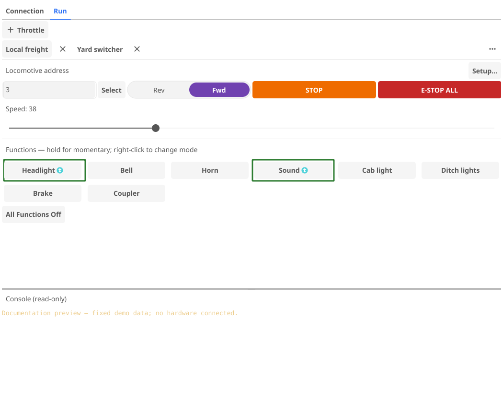
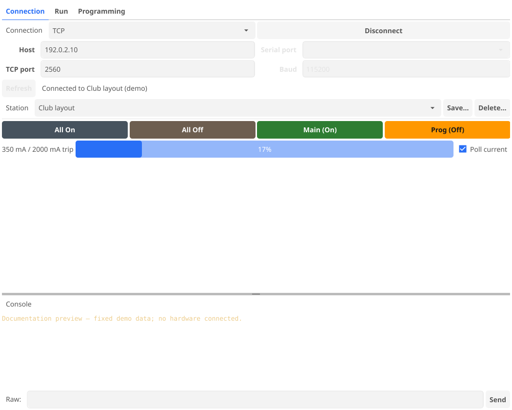
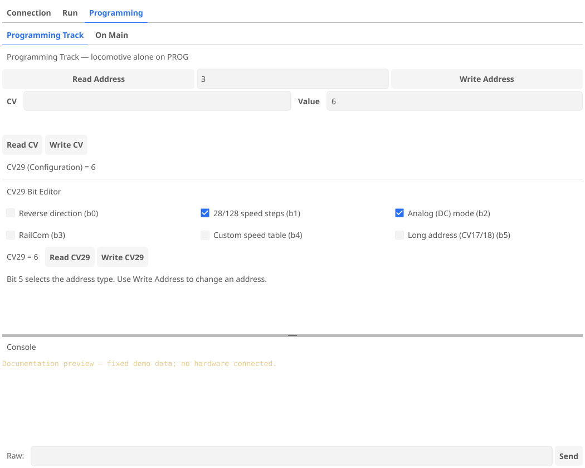
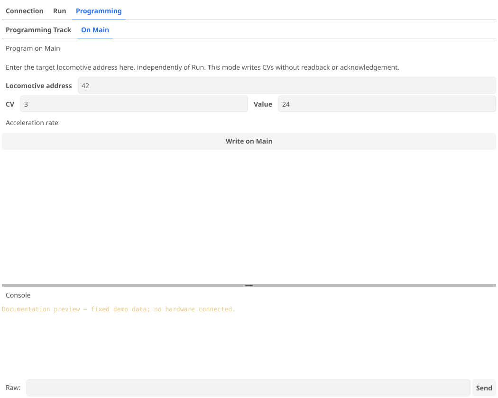
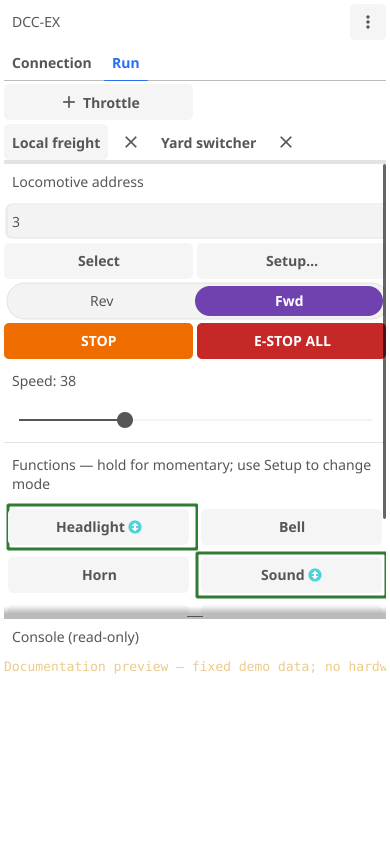
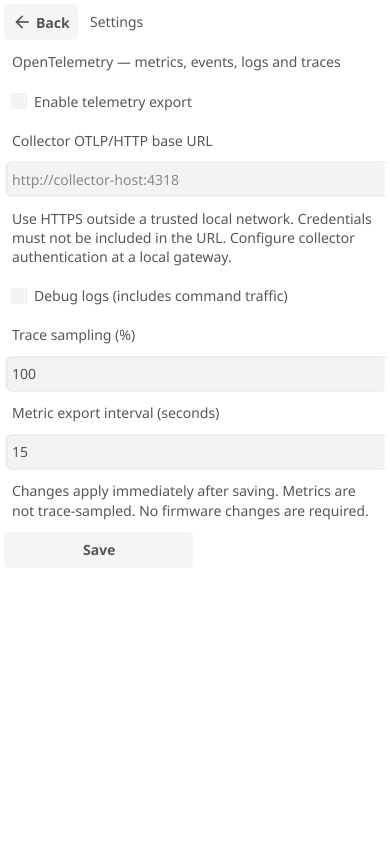

# Screenshots

These images are generated from the application's Fyne widgets using fixed
demonstration data, the light theme, and reproducible window sizes. They do not
show a live command station. Desktop captures are 1050 × 840 pixels; mobile
captures are 390 × 844 pixels. Native window borders, Android system bars, and
the on-screen keyboard are not included.

## Desktop Engineer mode

Named locomotive tabs, speed and direction controls, and per-loco function labels.



## Desktop Power Throttle mode

Saved connections, independent track-power states, and current monitoring.



Programming-track address/CV controls and the CV29 bit editor.



POM has its own target locomotive address, independent of the Run tabs.



## Mobile Engineer mode

The portrait layout places at most two function buttons on each row.
Scroll to reach additional functions.



Telemetry settings use an in-window page. Export is disabled by default.



## Regenerating the images

From the repository root, using Bash or Git Bash:

```bash
DCCEX_DOC_SCREENSHOTS="$PWD/docs/screenshots" \
  go test -tags ci -run '^TestDocumentationScreenshots$' -count=1 ./ui/fyne
```

The test uses temporary settings storage and a transport that rejects connection
attempts. It does not read personal app settings, connect to a command station,
or enable telemetry export. UI state and field values come from the fixture in
`ui/fyne/documentation_test.go`. It uses the normal application theme and widgets,
not a separately maintained mockup.

Without the environment variable, ordinary test runs generate images in a
temporary directory. The Application and UI tests workflow supplies
`dist/docs-screenshots` and retains the `documentation-screenshots` artifact for
seven days. CI never commits images automatically. Review the generated PNGs and
update the checked-in images when an intentional UI change affects documentation.

This is documentation generation, not screenshot-baseline testing or native
platform validation. Check screenshots visually before publishing. In particular,
the headless renderer can differ from native rendering; the scrollable locomotive
setup dialog is not included because the current software-rendered capture has
text-clipping artifacts. Use native app or emulator captures when
documenting operating-system UI or those rendering differences.
